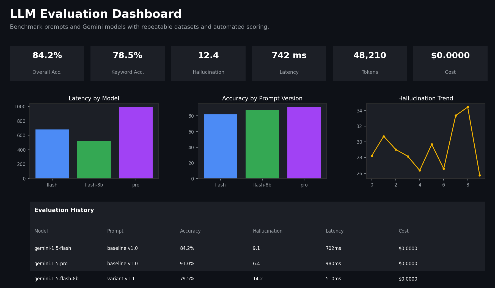

# LLM Evaluation Dashboard

A production-inspired evaluation platform for benchmarking prompts and LLM models against repeatable datasets — with automated scoring, latency analysis, token/cost tracking, lightweight hallucination detection, and exportable evaluation reports.

Built to run on the **free tier of the Google Gemini API**, so you can evaluate real prompts against real models at $0 cost.



---

## Overview

Shipping prompts and models to production without a repeatable evaluation process is how quality regressions slip through. This project is a self-contained "eval harness + dashboard" that lets you:

- Run the same benchmark questions against multiple prompt versions and multiple Gemini models
- Score every response automatically (semantic similarity + keyword coverage)
- Track latency, token usage, and cost per call
- Flag likely hallucinations with an explainable heuristic
- Compare results side by side and export them as CSV/JSON reports

It's designed to read like a small internal tool an engineering team would actually build and maintain — modular, typed, and testable — rather than a single monolithic notebook script.

---

## Features

- 📂 **Benchmark dataset loader** — CSV-based, versionable, easy to extend
- 📝 **Prompt version management** — name, version, and template multiple prompt variants from the UI
- 🔀 **Multiple prompt evaluation** — run several prompt versions in one sweep
- 🤖 **Multiple model comparison** — evaluate several Gemini models side by side
- ⚙️ **Automatic scoring pipeline** — orchestrates generation, timing, and scoring for every (question, prompt, model) triple
- 📐 **Response similarity scoring** — TF-IDF cosine similarity against the expected answer
- 🔑 **Keyword-based correctness scoring** — checks for required reference keywords
- ⏱️ **Latency tracking** — wall-clock time per API call
- 🔢 **Token usage tracking** — input/output/total tokens from the Gemini API's own usage metadata
- 💰 **Cost estimation** — $0 by default (free tier); paid-tier pricing table included for later use
- 🚨 **Hallucination tracking** — explainable heuristic combining missing keywords, low similarity, and unsupported numeric claims
- 🔍 **Side-by-side response comparison** — compare model/prompt outputs for the same question
- 🕘 **Evaluation history** — persisted in SQLite, browsable across sessions
- 📊 **Interactive dashboard** — Plotly charts for latency, cost, tokens, accuracy, and hallucination trend
- 📤 **Export evaluation report** — CSV and structured JSON
- 🛡️ **Error handling** — failed calls are retried, then recorded (not crashed) with error metadata
- 🎨 **Clean Streamlit UI** — tabs for running evals, dashboard, comparison, history, and dataset inspection

---

## Architecture

```
┌──────────────┐     ┌────────────────┐     ┌───────────────────┐
│  benchmark   │────▶│   evaluator    │────▶│      metrics       │
│ (CSV loader) │     │ (Gemini calls) │     │ (similarity, kw)    │
└──────────────┘     └───────┬────────┘     └───────────┬────────┘
                              │                          │
                              ▼                          ▼
                      ┌───────────────┐         ┌────────────────┐
                      │ hallucination │         │    pricing      │
                      │  (heuristic)  │         │ (cost estimate) │
                      └───────┬───────┘         └────────┬────────┘
                              │                           │
                              └─────────────┬─────────────┘
                                            ▼
                                  ┌────────────────────┐
                                  │  EvaluationResult    │
                                  │   (pydantic model)   │
                                  └──────────┬───────────┘
                                             ▼
                                   ┌───────────────────┐
                                   │      storage        │
                                   │ (SQLite + CSV/JSON)  │
                                   └──────────┬───────────┘
                                              ▼
                                    ┌───────────────────┐
                                    │   app.py (UI)       │
                                    │  Streamlit + charts  │
                                    └───────────────────┘
```

Each concern lives in its own module so the pipeline can be tested, extended, or reused (e.g. from the bundled Colab notebook) without touching the UI.

---

## Evaluation Workflow

1. Load the benchmark dataset (`data/benchmark_dataset.csv`).
2. Define one or more **prompt versions** (each must contain a `{question}` placeholder).
3. Select one or more **Gemini models** to evaluate.
4. Click **Run Evaluation** — the app iterates over every `(model × prompt version × benchmark question)` combination:
   - Calls the Gemini API and measures latency
   - Reads input/output token counts from the API's usage metadata
   - Estimates cost (free tier = $0.00)
   - Scores similarity, keyword accuracy, and blended overall accuracy
   - Runs the hallucination heuristic and records explanations
   - Persists the result to SQLite
5. Explore results in the **Dashboard**, **Side-by-Side**, and **History** tabs.
6. Export a CSV or JSON report for sharing or further analysis.

---

## Folder Structure

```
llm-evaluation-dashboard/
├── app.py                          # Streamlit application entry point
├── requirements.txt
├── .env.example
├── README.md
├── data/
│   └── benchmark_dataset.csv       # Sample benchmark questions
├── results/
│   └── evaluation_results.csv      # CSV export destination
├── reports/
│   └── evaluation_report.json      # JSON export destination
├── utils/
│   ├── evaluator.py                # Gemini API calls, timing, orchestration
│   ├── benchmark.py                # Dataset loading/validation
│   ├── metrics.py                  # Similarity + keyword scoring
│   ├── pricing.py                  # Cost estimation (free & paid tier)
│   ├── hallucination.py            # Hallucination heuristic
│   ├── storage.py                  # SQLite persistence + CSV/JSON export
│   └── charts.py                   # Plotly chart builders
├── models/
│   ├── evaluation.py               # Pydantic models (BenchmarkItem, EvaluationResult, ...)
│   └── database.py                 # SQLAlchemy engine/session/table
├── assets/
│   └── dashboard.png               # Dashboard preview image
└── notebooks/
    └── LLM_Evaluation_Dashboard.ipynb  # Standalone Colab walkthrough
```

---

## Installation

```bash
git clone https://github.com/kunalkirtak/LLM-projects/tree/main/03-llm-evaluation-dashboard
cd llm-evaluation-dashboard
python -m venv .venv
source .venv/bin/activate   # Windows: .venv\Scripts\activate
pip install -r requirements.txt
cp .env.example .env
```

Get a **free** Gemini API key from [Google AI Studio](https://aistudio.google.com/app/apikey) and either:

- Paste it into `.env` as `GOOGLE_API_KEY=...`, or
- Enter it directly in the Streamlit sidebar at runtime (not persisted)

---

## Environment Variables

| Variable | Description | Default |
|---|---|---|
| `GOOGLE_API_KEY` | Your Gemini API key (Google AI Studio, free tier) | — |
| `DEFAULT_MODEL` | Model pre-selected in the UI | `gemini-1.5-flash` |
| `DATABASE_URL` | SQLAlchemy connection string | `sqlite:///results/evaluations.db` |
| `FREE_TIER_MODE` | Forces cost estimation to `$0.00` | `true` |

---

## Dashboard Preview

The dashboard surfaces overall accuracy, keyword accuracy, hallucination score, latency, token usage, and cost as top-line metrics, plus charts for latency/cost/token comparison, accuracy by prompt version, and hallucination trend over time.

---

## Benchmark Dataset

The bundled sample dataset (`data/benchmark_dataset.csv`) contains 15 general-knowledge questions spanning biology, geography, literature, computer science, mathematics, and machine learning, each with:

- `question` — the prompt input
- `expected_answer` — the reference answer used for scoring
- `category` — topic grouping
- `difficulty` — Easy / Medium / Hard
- `reference_keywords` — pipe-separated (`|`) keywords the answer should mention

Extend it by adding rows in the same format — no code changes required.

---

## Evaluation Metrics

| Metric | How it's computed |
|---|---|
| **Similarity score** | TF-IDF vectorization + cosine similarity between response and expected answer (0–100) |
| **Keyword accuracy** | Percentage of `reference_keywords` found (case-insensitive) in the response |
| **Overall accuracy** | Weighted blend of similarity (50%) and keyword accuracy (50%) |
| **Latency** | Wall-clock milliseconds for the Gemini API call, including retries |
| **Token usage** | `prompt_token_count` / `candidates_token_count` from the Gemini response's `usage_metadata` |
| **Cost** | `$0.00` in free-tier mode; otherwise computed from the paid-tier price table in `utils/pricing.py` |
| **Hallucination score** | Weighted heuristic: missing keywords (45%) + low similarity (35%) + unsupported numeric claims (20%) |

---

## API Cost Analysis

This project defaults to `FREE_TIER_MODE=true`, so every evaluation reports **$0.00** — matching how the Gemini API free tier actually bills (rate-limited, not usage-billed). The pricing table in `utils/pricing.py` is kept in place so that flipping `FREE_TIER_MODE=false` immediately gives you realistic paid-tier cost estimates if you move to a billed Google Cloud project. Always double-check current prices at [ai.google.dev/pricing](https://ai.google.dev/pricing) before relying on them for budgeting.

---

## Hallucination Detection

The hallucination heuristic is intentionally lightweight and explainable — no second LLM call, no external fact-checking API. It combines:

1. **Missing keywords** — required facts absent from the response
2. **Low semantic similarity** — the response drifted from the expected answer
3. **Unsupported numeric claims** — numbers/dates in the response that don't appear anywhere in the expected answer (a common signature of fabricated specifics)

Every flagged response comes with a plain-language explanation (e.g. *"Response introduces numeric value(s) not present in the expected answer: 1962."*) shown in the dashboard.

---

## Example Outputs

```
[gemini-1.5-flash | baseline (v1.0)] What is the powerhouse of the cell? ->
  acc=91.2  halluc=4.0  latency=612ms  cost=$0.0000
```

Exported JSON report shape:

```json
{
  "generated_at": "2026-08-02T09:00:00Z",
  "total_evaluations": 30,
  "models_evaluated": ["gemini-1.5-flash", "gemini-1.5-pro"],
  "prompt_versions_evaluated": ["1.0", "1.1"],
  "results": [ { "...": "one row per evaluation" } ]
}
```

---

## Running the Project

```bash
streamlit run app.py
```

Then in the sidebar:

1. Paste your Gemini API key
2. Select one or more models
3. Add/select prompt versions
4. Click **Run Evaluation**
5. Explore the **Dashboard**, **Side-by-Side**, and **History** tabs
6. Export a CSV or JSON report from the **History** tab

To run the pipeline outside Streamlit (e.g. for CI or scripted sweeps), see `notebooks/LLM_Evaluation_Dashboard.ipynb`.

---

## Technologies Used

- **Python 3.11+**
- **Streamlit** — interactive dashboard UI
- **google-generativeai** — Gemini API SDK (free tier)
- **Pandas** — tabular data wrangling
- **Plotly** — interactive charts
- **Matplotlib** — static preview image generation
- **NumPy** — numerical operations
- **Pydantic** — typed data models and validation
- **python-dotenv** — environment configuration
- **SQLite / SQLAlchemy** — evaluation history persistence
- **Loguru** — structured logging
- **Jinja2** — available for custom report templating
- **Scikit-learn** — TF-IDF similarity scoring

---

## Skills Demonstrated

- LLMOps evaluation harness design (repeatable benchmarks, versioned prompts)
- API integration with retry/error handling for external LLM providers
- Automated NLP scoring (TF-IDF similarity, keyword coverage)
- Heuristic-based hallucination/quality detection with explainability
- Observability: latency, token, and cost instrumentation
- SQLAlchemy ORM modeling and persistence
- Pydantic-based typed data modeling and validation
- Interactive dashboard development with Streamlit + Plotly
- Modular, testable Python architecture (separation of concerns)
- Structured report generation (CSV/JSON export)

---

## Future Improvements

- Swap the TF-IDF similarity metric for embedding-based similarity (e.g. Gemini embeddings)
- Add an LLM-as-judge scoring mode as an optional, clearly-labeled second opinion
- Support additional providers (OpenAI, Anthropic, local models) behind the same `LLMEvaluator` interface
- Add statistical significance testing when comparing prompt versions
- Add authentication and multi-user history if deployed beyond local/dev use
- Containerize with Docker for one-command deployment

---

## License

MIT License — free to use, modify, and distribute.
